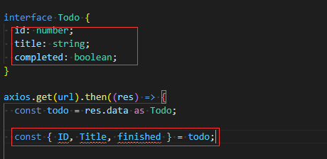
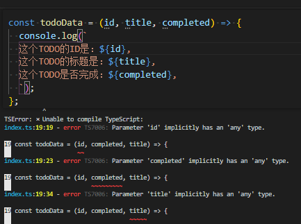
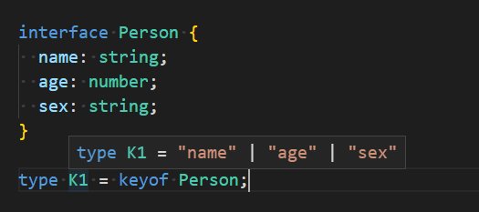
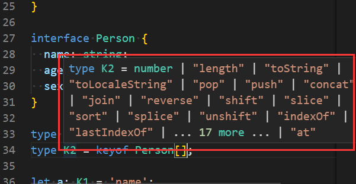
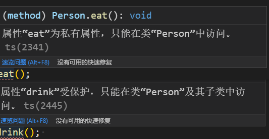
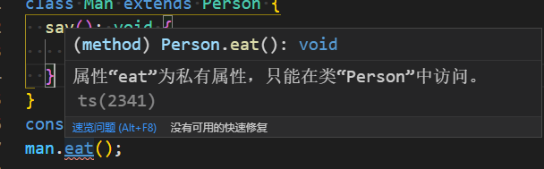

<!--
 * @Description: file content
 * @Version: file content
 * @Autor: jiuyi
 * @Date: 2022-05-27 16:09:17
 * @LastEditors: jiuyi
 * @LastEditTime: 2022-05-30 17:10:37
-->

# 01-TypeScript 基础

## 1. TypeScript 的基础介绍及使用

### 1.1 TypeScript 是什么

#### 1.1.1 TypeScript 介绍

先来了解一下什么是类型系统，类型系统具有一下几个特点：

- 在开发过程中找错
- 使用类型注解来分析代码
- 仅存在于 **_开发阶段_**，甚至不在浏览器上运行
- **_不会提供性能优化_**
  TypeScript = JavaScript + **_类型系统_**
  TypeScript 编译过程: TypeScript 代码 -> TypeScript 编译器 -> JavaScript 代码

#### 1.1.2 安装与使用 TS

全局安装 typescript 和 ts-node

```
npx tsc xxx.ts  -> 编译ts文件
npx ts-node xxx.ts  -> 编译并运行ts文件
```

#### 1.1.3 TypeScript 能做些什么

- 定义接口，接口定义值的类型
  interface：接口，定义结构，不满足就会报错，不需要等到编译的时候才看到错误
  

- 函数传参的时候，即使不正确，运行的时候才能看到错误
  直接定义参数的类型注解，可以避免这种错误，在书写的时候就会报错
  
  

### 1.2 类型

#### 1.2.1 对于类型的理解及使用场景

- **什么是类型：Types**
  一个方便我们去更**简便的描述**一个具有**相应属性的方法**和**值**的东西
  <br/>

- **什么是类型：Types**
  是我们能够赋值给变量的东西（variable）
  不同的值 -> 不同的类型
  <br/>

- **什么是一个方便我们去更简便的描述一个具有相应属性的方法和值的东西** 1. 它是一个值 具有具有 charAt()、concat()、includes()这类方法的值 2. 更简便的方式：它是一个字符串 -> 类型
  <br/>

- example

```typescript
interface Todo {
	id: number;
	title: string;
	completed: boolean;
}
const todo = result.data as Todo;
```

&emsp;上述代码块中 result.data 怎么样来描述它呢?
&emsp;&emsp;1. 它是一个对象具有 id, title,completed 属性的对象
&emsp;&emsp;2. 它是一个 Todo 类型的值
</br>

- **总结**

1. 类型指的是一个方便我们去描述一个**具有相应的属性和方法的值**的这样的一个东西
2. **每一个值都会有相应的类型**

#### 1.2.2 类型的基础分类

- 类型的分类：

  1. 元类型(primitive types) number boolean undefined void string symbol null
  2. 对象类型(object types) functions arrays classes objects
     </br>

- 为什么要用类型?

  1. 能够帮助 TS 编译器分析我们的代码
  2. 能够帮助其他的工程师去理解整个代码库里面存在的值到底是什么东西

- 类型的使用场景
  1. 使用 TypeScript 的副作用->无论我们是不是想要
  2. TypeScript 中任意的一个值都有类型，即使我们不想要

---

## 2. TypeScript 的类型注解与类型推断

### 2.1 基本概念

1. 类型注解 -> 开发者手动告诉 TypeScript 类型（等号分隔了类型注解和值）
2. 类型推断 -> TypeScript 尝试去推断值的类型（尽量使用类型推断，而不是类型注解）

   _类型注解：_

   ```typescript
   // 元类型
   let scores: number = 50;
   let sports: string = 'basketball';
   let isHappy: boolean = true;
   let nothingMuch: null = null;
   let nothing: undefined = undefined;
   let today: Date = new Date();

   // 对象类型 class object function array
   // arr
   let balls: string[] = ['1', '2', '3'];
   let nums: number[] = [1, 2, 3];
   let truth: boolean[] = [true, false];

   // class
   class Car {}
   let car: Car = new Car();

   // object
   let person: { name: string; age: number } = {
   	name: '张三',
   	age: 20,
   };

   // function 函数类型注解要注意参数和返回值
   // 如果没有返回值 -> void
   const logNumber: (num: number) => void = (num: number) => {};
   ```

   _类型推断_

   ```typescript
   let names = 'li'; // let names: string
   let isFemale = false; // let isFemale: boolean
   let age = 22; // let age: number
   let _null = null; // let _undefined: any
   let _undefined = undefined; // let _undefined: any
   let date = new Date(); // let date: Date
   let arr = [1, '2', 3]; // let arr: (string | number)[]
   let obj = { a: 1, b: '2' }; // let obj: { a: number; b: string; }
   ```

### 2.2 使用类型注解的场景

#### 2.2.1 手动添加类型注解的 3 种情况

1. 变量声明和变量初始化不在同一行

```typescript
let score: number; //变量声明
score = 50; //变量初始化
```

2. 当一个函数返回 any 类型，但我们想要明确具体类型（比如 json.parse）

```typescript
const json = '{ "name":"张三","age": 20}';
let person = JSON.parse(json); // let person: any

const json = '{ "name":"张三","age": 20}';
// let person: { name: string; age: number; }
let person: { name: string; age: number } = JSON.parse(json);
```

3. 当我们想要一个变量拥有一个不能推断出来的类型

```typescript
let numbers = [-10, 0, 1];
let numAboveZero: boolean | number = false;
for (let i = 0; i < numbers.length; i++) {
	if (numbers[i] > 0) {
		numAboveZero = numbers[i];
	}
}
```

#### 2.2.2 什么时候使用类型推断

&emsp;当变量声明和变量初始化在同一行的时候，类型推断系统才会起作用。

&emsp;ts 中变量是 any 是一种坏事，一种类型，和字符串类型、布尔类型 ─ 样，意味着 TS 不知道正确的类型，这样就没法检查代码，尽量避免变量的类型为 any 类型！

### 2.3 对象类型的栗子

#### 2.3.1 函数的类型注解

```typescript
// 函数字面量
function name(params: type): returnType {}

function multiply(a: number, b: number): number {
	return a * b;
}
```

```typescript
// 匿名函数
function (params:type): returnType {}

const divide = function (a: number, b: number): number {
  return a / b;
};
```

```typescript
// 函数表达式
const fn = function name(params: type): returnType {};

const addNums = (a: number, b: number): number => {
	return a + b;
};
```

```typescript
// 没有返回值
const logger = (message: string): void => {
	console.log(message);
};

/* 返回值不存在的情况（void只能是null/undefined,但是never就是没有）
返回never的函数必须存在无法达到的终点 */

// 因为总是抛出异常，所以 error 将不会有返回值
function error(message: string): never {
	throw new Error(message);
}

// 因为存在死循环，所以 infiniteLoop 将不会有返回值
function infiniteLoop(): never {
	while (true) {}
}
```

_函数参数解构的类型注解_

```typescript
// 没有解构的类型注解
const todayweather = { data: new Date(), weather: '晴天' };
const logweather = todayweather => {
	console.log(todayweather.data);
	console.log(todayweather.weather);
};
logweather(todayweather);
```

```typescript
//加解构，没做类型注解
const ES6logweather = ({ data, weather }) => {
	console.log(data);
	console.log(weather);
};
ES6logweather(todayweather);
```

```typescript
// 结合上面两种情况
const ES6logweather = ({ data, weather }: { data: Date; weather: string }) => {
	console.log(data);
	console.log(weather);
};
ES6logweather(todayweather);
```

#### 2.3.2 对象的类型注解

```typescript
const profile = {
	name: 'Mike', // 元类型使用类型推断
	age: 20,
	coords: { lat: 30, lng: 50 },
	setAge(age: number): void {
		this.age = age;
	},
};

// 解构单个属性
const { age }: { age: number } = profile;

// 解构多个属性
const { age, name }: { age: number; name: string } = profile;

// 解构属性的属性
const {
	coords: { lat, lng },
}: { coords: { lat: number; lng: number } } = profile;
```

#### 2.3.3 数组和元组的类型注解

```typescript
// 注解类型单一的数组（有初始值的话可以直接使用类型推断）
const basketballPlayers = ['Kobe', 'James ', 'Pierce'];
const basketballPlayers: string[] = ['Kobe', 'James ', 'Pierce'];

// 注解多种类型的数组（有初始值的话可以直接使用类型推断）
const importantDates = [new Date(), '2020-10-01'];
const importantDates: (Date | string)[] = [new Date(), '2020-10-01'];
```

1. 数组类型注解的作用：
   提取值的时候帮助推断防止加入不一样类型的值
   使用 map、forEach、reduce 函数时提供帮助
   灵活性―数组依旧可以容纳不同类型
   </br>
2. 什么时候用类型化数组 ?
   代表一些(相似类型)记录的数据结构
   </br>
3. 元组 tuples：和数组很类似的数据结构
   当存储的元素数据类型不同，则需要使用元组
   每一个元素代表一个记录的不同属性，顺序也要符合定义的顺序

```typescript
const tuples:[type...] = [...]
// 元组的基础使用
const pepsi: [string, boolean, number] = ['brown', true, 35];

// 元组的类型别名 Type Alias
type Drink = [string, boolean, number];
const sprite: Drink = ['clear', true, 40];
```

---

## 3. TypeScript 的接口与 type 关键字

### 3.1 接口

#### 3.1.1 接口的定义

定义对象的类型
接口的作用就是为这些类型命名和为你的代码或第三方代码定义类型

#### 3.1.2 接口的基础使用

接口(interface) +  类  ->  高度复用的代码

```typescript
// 必须属性
interface Person {
	name: string;
	age: number;
}

// 赋值的时候，变量的形状必须和接口的形状保持一致
const person: Person = {
	name: 'li',
	age: 20,
};
```

```typescript
// 可选属性
interface Person2 {
	name: string;
	age: number;
	isMan?: boolean;
}

// 赋值的时候可以不需要完全匹配一个形状
const person2: Person2 = {
	name: 'LI',
	age: 22, // isMan: false, 可选
};
```

```typescript
// 只读属性
interface Person3 {
	name: string;
	age: number;
	isMan?: boolean;
	readonly money: number;
}

// 只读属性只能在对象刚刚创建的时候修改其值
const person3: Person3 = {
	name: 'LI',
	age: 22,
	money: 0,
};
person3.money = 100; // 报错
```

```typescript
// 任意属性(字符串索引签名)
interface Person4 {
	name: string;
	age?: number; // [propName: string]: any;
	[propName: string]: number | string;
}

const person4: Person4 = {
	name: 'li',
	addr: 'sz',
};
```

```typescript
// 类类型接口: 够用它来明确的强制一个类去符合定义
interface ClockInterface {
	currentTime: Date;
}

class Clock implements ClockInterface {
	currentTime: Date;
	constructor(h: number, m: number) {}
}
```

#### 3.1.3 接口实现高度复用

TS 中代码复用的一般策略：定义接收接口指定类型参数的函数，存在对象 / 类去满足接口的必要条件

```typescript
interface Reportable {
	summary(): string;
}
const uncleMike = {
	name: 'Mike ',
	age: 20,
	married: false,
	summary(): string {
		return `名字: ${this.name}`;
	},
};
const drinks = {
	color: '棕色',
	carbonated: true,
	sugar: 35,
	summary(): string {
		return `这个饮料的颜色是${this.color} `;
	},
};

/* Reportable接口是作为printSummary函数的门卫的存在
必须满足Reportable接口的必要条件才能够被printSummary函数使用 */
const printSummary = (item: Reportable): void => {
	console.log(item.summary());
};
printSummary(uncleMike);
printSummary(drinks);
```

### 3.2 type 关键字

#### 3.2.1 type 关键字和 interface 相同点

type 和 interface 用于定义数据的类型别名，type 可以继承 type，interface 可以继承 interface，type 可以和 interface 交叉

```typescript
type K1 = {
	name: string;
	age: number;
};

type K2 = boolean;

interface K3 {
	name: string;
	age: number;
}

interface K4 {
	sex: boolean;
}

type K5 = K1 & { sex: boolean };
type K6 = K4 | { sex: boolean };

interface K7 extends K1 {
	sex: boolean;
}

interface K8 extends K7 {
	sex: boolean;
}
```

#### 3.2.2 type 关键字和 interface 不同点

type 可以声明基本类型别名、联合类型、元组等

```typescript
// 基本类型别名
type Name = string;

// 联合类型
interface Dog {
	wong();
}
interface Cat {
	miao();
}

type Pet = Dog | Cat;

// 具体定义数组每个位置的类型
type PetList = [Dog, Pet];
```

type 语句中可以使用 typeof 赋值

```typescript
let K1 = {
	name: 'aa',
	age: 18,
};

type K2 = typeof K1;
```

interface 可以合并声明

```typescript
interface User {
	name: string;
	age: number;
}

interface User {
	sex: string;
}

/*
User 接口为 {
  name: string
  age: number
  sex: string
}
*/
```

#### 3.2.3 keyof

```typescript
interface Person {
	name: string;
	age: number;
	sex: string;
}

type K1 = keyof Person;
```


可以看到一个 type keyof 了一个 person，最后的结果是一个联合类型，变量的类型是 K1 的时候，值只能是”name“ | "age" | "sex"，keyof 实际上就是拿到是键名

```typescript
type K2 = keyof Person[];
```



---

## 4. TypeScript 的类

### 4.1 类的定义

类:定义一个对象的蓝图,**描述了这个对象的属性和方法**

#### 4.1.1 类的修饰符

- public -> 这个方法能够在任何地方被调用
- private -> 这个方法只能在当前这个类的其他方法中被调用(**实例不能调用**)
- protected -> 这个方法能够在**当前这个类**的其他方法或者**子类**的其他方法中调用(**实例不能调用**)
- readonly -> 这个属性必须在声明时或构造函数里被初始化

### 4.2 举个栗子

定义一个类的方法：

```typescript
class Person {
	say(): void {
		console.log('person');
	}
	eat(): void {
		console.log('person eat');
	}
	drink(): void {
		console.log('person drink');
	}
}

const person = new Person();
person.say(); // person
```

定义一个子类：
子类(派生类)可以继承、重写父类(超类)的方法

```typescript
class Man extends Person {
	say(): void {
		console.log('man');
	}
}

man.say(); // man
man.eat(); // person eat
```

给方法加上修饰符：

```typescript
class Person {
	public say(): void {
		console.log('person');
	}

	private eat(): void {
		console.log('person eat');
	}

	protected drink(): void {
		console.log('person drink');
	}
}

const person = new Person();
```

实例访问 eat 方法和 drink 方法报错，因为 private 和 protected 不能在实例访问
子类访问 eat 报错，因为 private 不能在子类访问


给派生类增加一个 public 方法，里面调用 eat 方法和 drink 方法曲线救国修改一下父类，让外部访问

```typescript
public transit(): void {
  this.eat();
  this.drink();
}
```

给方法加上属性，不加修饰符的时候相当于 public

```typescript
class Person {
  name: string = 'li';
  ...
}

console.log(person.name); // li
console.log(man.name); // li
```

如果需要给属性动态值，加上 constructor

```typescript
class Person {
  public name;
  constructor(name: string) {
    this.name = name;
  }
  ...
}
```

每个类自己的 constructor 其实就是定义自身的属性和方法，而不是原型上的。可以直接使用 this.xxx 来添加，this 指自己，super 指父类。
**子类继承的时候不写 constructor，则默认会把父类自身的属性和方法生成到子类**

---

## 5. TypeScript 的泛型

### 5.1 泛型的定义

泛型：一种方法使返回值的类型与传入参数的类型是相同的。 它是一种特殊的变量，只用于表示类型而不是值。（**_传入什么类型传出什么类型_**；**_泛型就是个变量_** -> 这个变量就是类型，可以用任何字母来写）

```typescript
function fanx<T>(params: T): T {
	return params;
}

fanx(123);
```

### 5.2 泛型函数与泛型接口

泛型变量赋值泛型函数

```typescript
function fanxfun<T>(arg: T): T {
	return arg;
}

let a: { <T>(arg: T): T } = fanxfun;
```

泛型接口

```typescript
interface fanx {
	<T>(arg: T): T;
}
```

其实可以看到泛型接口和泛型变量赋值泛型函数是一样的，所以可以通过接口这么来定义：

```typescript
let a: fanx = fanxfun;
```

但是这样就没有办法定义泛型的变量了，就可以把变量提到接口最后

```typescript
interface fanx<T> {
	(arg: T): T;
}
```

函数泛型的注解方式：

```typescript
let a: <T>(arg: T) => T = fanxfun;
```

对象字面量：

```typescript
let a: { <T>(arg: T): T } = fanxfun;
```

泛型接口：

```typescript
let a: fanx = fanxfun;
```

泛型类其实和泛型接口差不多：
泛型类指的是实例部分的类型，所以类的静态属性不能使用这个泛型类型

```typescript
class GenericNumber<T> {
	zeroValue: T;
	add: (x: T, y: T) => T;
}

let myGenericNumber = new GenericNumber<number>();
```

### 5.3. 泛型约束

泛型类型实际上是非常广的，可以通过接口来约束泛型
假设一个函数传入一个值，不确定这个值的类型，但是需要获取这个值的长度

```typescript
function Identify<T>(params: T): T {
	// 如果params没有长度属性怎么办?
	console.log(params.length);
	return params;
}
```

可以给传入参数指定类型，但是这样就太不灵活了

```typescript
function Identify<T>(params: T[]): T[] {
	// 如果params没有长度属性怎么办?
	console.log(params.length);
	return params;
}
```

可以使用接口继承

```typescript
interface LenthWise {
	length: number;
}

function Identify<T extends LenthWise>(params: T): T {
	// 如果params没有长度属性怎么办?
	console.log(params.length);
	return params;
}
```

接口可以继承接口 -> 接口是用来描述一个对象的 -> 继承的话就是多个接口描述对象
泛型约束不一定是接口，也可以是定义

```typescript
type LenthWise = string;
function Identify<T extends LenthWise>(arg: T): T {}
```

---

## 6. 枚举

### 6.1 枚举定义

枚举：使用枚举我们可以定义一些带名字的常量
在通常情况下我们定义一组常量需要这样：

```typescript
const first: number = 1;
const second: number = 2;
const third: number = 3;
```

但是利用枚举 enum:

```typescript
enum num = {
  first:1,
  second,
  third,
}
```

访问方式也和对象一样：

```typescript
num['first'];
num.first;
```

### 6.2 枚举分类

1.  数字枚举：
    特点：可自增、反向映射、可计算、如果不给枚举类型初始化默认是数字枚举类型

    ```typescript
    // 可自增
    enum NUM1 = {
        first:1,
        second,
        third,
    }
    console.log(NUM1.second ,NUM1.third); // 2 3

    // 可计算
    enum NUM2 = {
        first:1 + 2,
        second: NUM1.first,
        third: second * 2 ,
    }
    console.log(NUM2.first, NUM2.second ,NUM2.third); // 3 1 2

    // 反向映射：生成键值对的同时也可以生成值键对
    console.log(NUM2[NUM2.first]); // first
    // 官网的例子
    enum NumEnum { one, two }
    // 编译后
    var NumEnum;
    (function (NumEnum) {
        NumEnum[NumEnum["one"] = 0] = "one";
        NumEnum[NumEnum["two"] = 1] = "two";
    })(NumEnum || (NumEnum = {}));

    // 默认初始化
    enum NUM3 = {
        first,
        second,
        third,
    }
    console.log(NUM3.first, NUM3.second ,NUM3.third); // 0 1 2
    ```

2.  字符串枚举：
    特点：需要初始化、没有反向映射

    ```typescript
    // 需要初始化
    enum STR1 {
    	one = 'one',
    	two = 'two',
    }

    // 没有反向映射
    // 看一下编译结果：如果生成值键对，将毫无意义， 因为会覆盖掉
    var STR1;
    (function (STR1) {
    	STR1['one'] = 'one';
    	STR1['two'] = 'two';
    })(STR1 || (STR1 = {}));
    ```

3.  混入（异构）枚举：
    特点：混合定义

    ```typescript
    enum ENUM1 {
    	one = 1,
    	two = 'two',
    }
    ```

### 6.3 声明方式分类：

按照声明方式分为：普通枚举（上面那样定义的）、const 枚举、外部枚举、外部常量枚举
const 枚举：
特点：**_无法访问枚举对象，只能访问对象内属性、不生成反向映射_**

```typescript
const enum ENUM1 {
	one = 1,
	two = 2,
}
console.log(ENUM1); //  => 抛出错误,运行时不存在
console.log(ENUM1[ENUM1[one]]); //  => 抛出错误,运行时不存在
```
